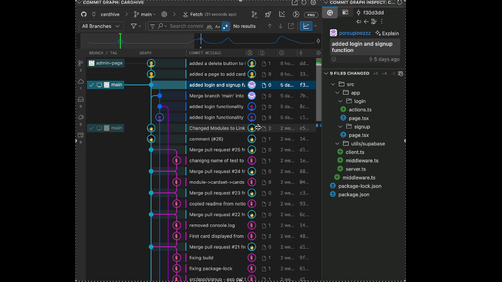
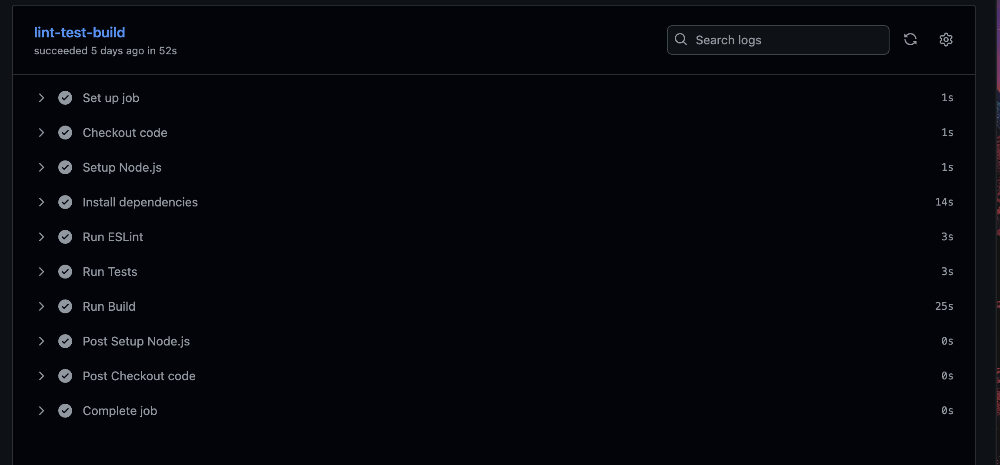
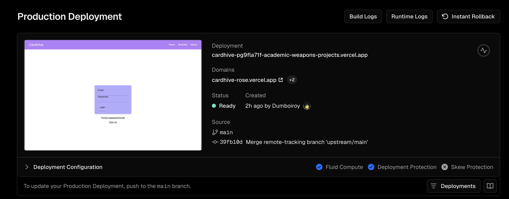
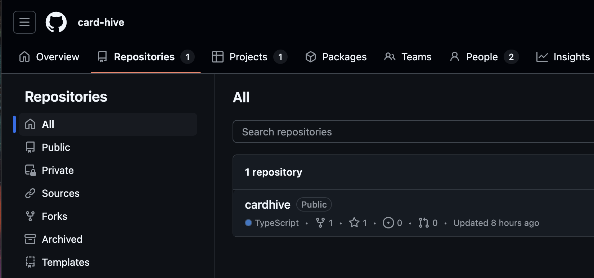
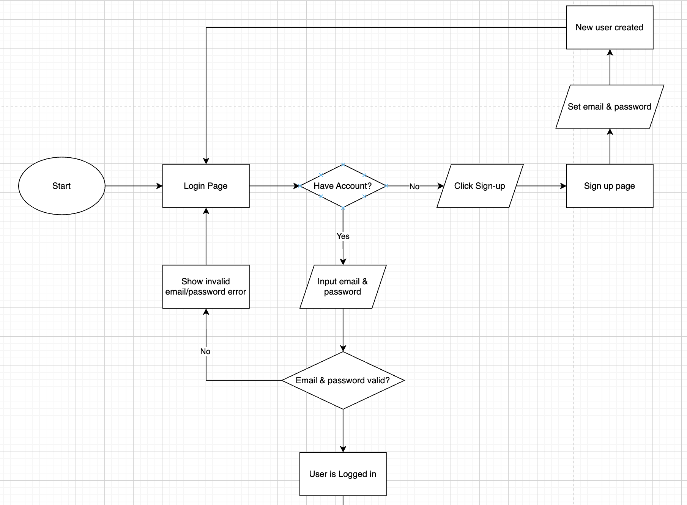

# README

# **Motivation**

As students, we realised that building a strong foundation early in our learning process is crucial for long-term success. However, we struggled to find targeted, high-quality resources that were both collaborative and efficient in helping us understand concepts deeply. Existing platforms like Quizlet and Anki provide great individual learning experiences, but they lack an organized, structured approach for university students to share, verify, and consolidate knowledge in a meaningful way.

That’s why we wanted to create a Flashcard Sharing System within NUS—an intelligent, collaborative platform where students can create, verify, and share flashcards based on module codes. This ensures that learning materials are accurate, relevant, and easily accessible to everyone in the course.

# **Aim**

By enabling features like peer verification, private and public sharing, customizable quizzes, and a gamified rewards system, this app bridges the gap between individual learning and collective knowledge-building. It empowers students to not just memorize, but actively engage with and refine their understanding—all while making the process more social and interactive.

The goal is simple: to make structured learning more efficient, reliable, and enjoyable—especially in an academic environment where time and accuracy matter the most.

# **User Stories**

1. As a **student** who wants to study efficiently, I want to **create my own flashcards** with text and images so that I can review concepts easily.
2. As a **student** who studies multiple subjects, I want to **mix and match flashcards from different topics** so I can test myself on all related material in one session.
3. As a **student** who wants control over my learning, I want to **edit, remove, and organize my flashcards** so that I can focus on what matters.
4. As a **student** who needs to prepare for exams, I want to **generate a flashcard quiz that includes multiple topics** so I can review everything in one go.
5. As a **student** who makes mistakes, I want to **flag difficult questions** so I can review them later.
6. As a **student** who enjoys personalization, I want to **unlock and buy different flashcard skins** to make my learning experience more fun.
7. As a **student** who enjoys competition, I want to **earn rewards for completing quizzes** to stay motivated.
8. As a **student** who wants to improve, I want to **see my strengths and weaknesses** based on my quiz performance so I can focus on areas where I struggle.
9. As a **student** who studies over time, I want to **track my study history** so I can measure my progress.

# **Features**

### 🔑 Core Features

1. **Create Flashcard Sets by Module**

    Users can create flashcard sets within predefined **NUS module codes**. This ensures flashcards are organized and relevant to specific academic content.

2. **Share Card Sets via Hives**

    Users can share flashcard sets within **Hives** – private friend groups where members can **view, save, and collaborate** on card sets.

3. **User Authentication (Students, TAs, Professors)**

    The system supports account creation and login for **students, teaching assistants, and professors**, each with role-based permissions.

4. **Flashcard Verification by TAs/Professors**

    Verified users (TAs or professors) can **review and approve flashcards**, adding an extra layer of academic credibility to shared content.

5. **Flashcard Set Reviews & Ratings**

    Users can leave **written reviews (100–200 words)** and rate flashcard sets. An **average star rating** will be shown at the card set selection page.

    _(Note: Reviews will appear on a future Card Set Intro Page.)_

---

### ⏭️ Extension Features (Planned)

1. **Test Mode with Auto-Marking (MCQ Only)**

    Users can toggle flashcards as **MCQ**. In **test mode**, the app auto-generates quizzes using only MCQ flashcards and auto-marks responses.

2. **Mix-and-Match Across Card Sets**

    Users can **combine flashcards** from multiple card sets to create custom study decks across topics or modules.

3. **Paid Customization Options**

    Premium users can unlock **customizable flashcard appearances** (e.g., themes, fonts, card animations).

4. **Private Card Sets for Friend Groups**

    Users will be able to create **private card sets**, shared only within their Hive for internal collaboration and privacy.

---

### 🔮 Future Enhancement: Verified Modules

While modules will be **predefined in the app** initially, we plan to allow **verified users** (TAs or professors) to **create and validate new modules**, making the system scalable and inclusive of special or elective courses.

# **Timeline**

1. Milestone 1 - Technical proof of concept (i.e., a minimal working system with both the frontend and the backend integrated for a very simple feature)

    Basic User flow: (Choose Module -> Choose Card Set -> Show Flashcards)

    1. Card Sets: To group flashcards
    2. Flashcard display: Should be able to display flashcards in a easy-to-test-yourself manner

2. Milestone 2 - Prototype (i.e., a working system with the core features)
    1. User accounts: Student, Teaching Assistant and Professor
        1. Teaching Assistant and Professors can verify flashcards
        2. Students can save Card Sets - need to find out how to set up link between card sets and accounts
        3. Students can rate and review flashcards/Card Sets
    2. Flashcard Database in Firebase: Card Sets should be stored in the cloud database so that other people can access them.
3. Milestone 3 - Extended system (i.e., a working system with both the core + extension features)
    1. Flashcard creation feature to allow users to at least be able to create simple flashcards. Fields are: Module, Question, Answer
    2. Tests based on topics/card sets selected - Random flashcards chosen from topics specified
    3. Customizable skins and appearances for cards/profile/UI elements (Maybe some paid features, but does not affect core functionality)
    4. Functionality to allow private card sets for internal sharing

# **Tech Stack**

| Component    | Technology                                       |
| ------------ | ------------------------------------------------ |
| Frontend     | Next.js (React)                                  |
| Backend      | Node.js (Express/NestJS) + Firebase              |
| Database     | Supabase                                         |
| Auth         | Supabase Auth                                    |
| ~~Storage~~  | ~~Firebase Storage~~                             |
| ~~Payments~~ | ~~Stripe~~                                       |
| Hosting      | Vercel (frontend) + ~~Railway/Render (backend)~~ |

## 🌐 Architecture Overview

_A visual breakdown of how the different components interact._

TODO: _Add architecture diagram_

`/docs/architecture.png` or `/public/system-diagram.png`

---

# TODO: Database

# SWE Practices

## 🧪 Frontend Engineering Workflow Overview

This document outlines the key practices and tooling used in this project to ensure maintainable, consistent, and high-quality code delivery.

---

## ✅ Component Testing

We use **unit tests** to verify the functionality of React components using libraries such as:

- [`@testing-library/react`](https://testing-library.com/docs/react-testing-library/intro/)
- [`vitest`](https://vitest.dev/) or [`jest`](https://jestjs.io/)

This ensures each component behaves correctly in isolation and regressions are caught early.

```
// Example test
import { render, screen } from '@testing-library/react';
import MyComponent from './MyComponent';

test('renders the title correctly', () => {
  render(<MyComponent />);
  expect(screen.getByText('Welcome!')).toBeInTheDocument();
});

```

## 🗂️ Git & GitHub for Version Control

All version control is managed via **Git**, with **GitHub** used for remote repository hosting and collaboration.

### Git Practices:

- Descriptive commit messages (e.g., `feat: add flashcard grid layout`)
- Rebased or squashed commits before merging
- Regular pushes to ensure backup and collaboration

_GIF: GitHub branch graph_



---

## 🧹 Pre-commit Hooks: Lint, Format & Test

We use [`lint-staged`](https://github.com/okonet/lint-staged) and `husky` to enforce code quality **before commits** are allowed.

### Pre-commit tasks include:

- ✅ Linting (`eslint`)
- ✅ Formatting (`prettier`)
- ✅ Type checking
- ✅ Running component tests

```bash
npx husky add .husky/pre-commit "npx lint"
```

_GIF: terminal showing lint-staged running on commit_


---

## 🌿 Feature-based Branching Strategy

Each new feature, bugfix, or enhancement is developed in a **dedicated Git branch** following a naming convention:

- `feat/cardset-grid`
- `fix/modal-close-issue`
- `chore/update-readme`

### Benefits:

- Parallel development
- Easier code review
- Isolated testing before merge

---

## 🔐 Main Branch Protection & PR Checks

The `main` branch is **protected** to prevent direct pushes.

### ✅ Required for every Commit:

- Lint must pass
- Tests must pass

These checks are enforced locally using **Husky** (pre-commit and pre-push hooks). To ensure these rules apply consistently across all contributors, they're also reinforced via **GitHub Actions CI** (Below).

### ✅ Required for every Pull Request:

- Lint must pass
- Tests must pass
- Build must succeed (`npm run build`)

All of these are enforced via GitHub Actions CI checks.

_image: GitHub PR with passing checks & required status checks_



---

## ⚙️ CI/CD with Vercel

We use **Vercel** for seamless CI/CD.

- Every push to a branch spins up a **preview deployment**
- Every merge to `main` triggers a **production deployment**
- Environment variables are managed via Vercel Dashboard

**Note**: Due to free tier limitations:

- We fork and push to personal repos for deploy previews
- PRs are created back to the main repo under the GitHub Organization

_image: Vercel dashboard_



---

## 🏢 GitHub Organization Structure

Project code is managed under a **GitHub Organization** for:

- Centralized access control
- Audit-friendly code ownership
- Shared CI/CD & environment management

Team members contribute via fork + PR model where necessary.

_image: GitHub organization team_



---

## 🔄 Summary of Workflow

```mermaid

graph TD
FB[Feature Branch] -->|Code & Commit| PCLT[Pre-commit lint & tests]
PCLT -->|pass| PTG[Push to GitHub]
PCLT -->|fail| RC[Reject Commit]
RC --> FB
PTG --> PR[Pull Request to Main]
PR --> LTB[GitHub Actions: Lint, Test, Build]
LTB --> |pass| CRAA[Code Review & Approval]
LTB -->|fail| RPR[Reject Pull Request]
RPR -->|Fix the Build & Commit| PCLT
CRAA --> SMTM[Squash & Merge to Main]
SMTM --> PDV[Production Re-deployment via Vercel]
```

---

## 📁 Directory Suggestions for Supporting Files

```bash
/.husky/             # Husky hooks
/.github/workflows/  # GitHub Actions, integration tests
```

# Application Flow Diagram




# ERD Diagram for Database


# Prototype


# Deployment

For now, only CS2040S & CS2030S has cardsets added.

Create Account → Login → Modules → CS2040S → CS2040S First Set

[https://cardhive-rose.vercel.app/](https://cardhive-rose.vercel.app/)
