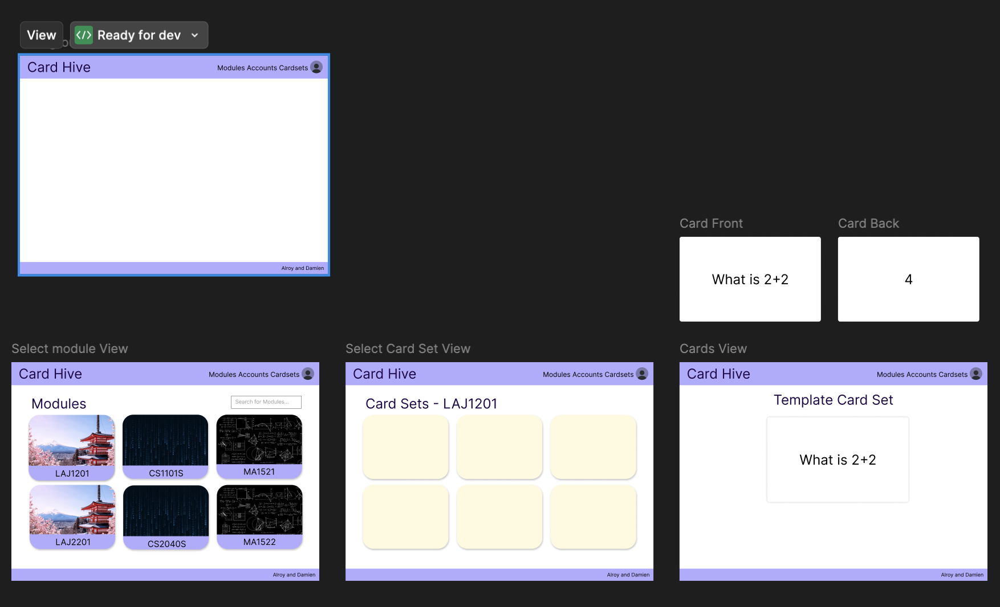

# README

[README](https://www.notion.so/README-202f47d19e6f80bdbe83f5c09c3efe7d?pvs=21)

# **Motivation**

As students, we realised that building a strong foundation early in our learning process is crucial for long-term success. However, we struggled to find targeted, high-quality resources that were both collaborative and efficient in helping us understand concepts deeply. Existing platforms like Quizlet and Anki provide great individual learning experiences, but they lack an organized, structured approach for university students to share, verify, and consolidate knowledge in a meaningful way.

That’s why we wanted to create a Flashcard Sharing System within NUS—an intelligent, collaborative platform where students can create, verify, and share flashcards based on module codes. This ensures that learning materials are accurate, relevant, and easily accessible to everyone in the course.

# **Aim**

By enabling features like peer verification, private and public sharing, customizable quizzes, and a gamified rewards system, this app bridges the gap between individual learning and collective knowledge-building. It empowers students to not just memorize, but actively engage with and refine their understanding—all while making the process more social and interactive.

The goal is simple: to make structured learning more efficient, reliable, and enjoyable—especially in an academic environment where time and accuracy matter the most.

# **User Stories**

1. As a **student** who wants to study efficiently, I want to **create my own flashcards** with text and images so that I can review concepts easily.
2. As a **student** who studies multiple subjects, I want to **mix and match flashcards from different topics** so I can test myself on all related material in one session.
3. As a **student** who wants control over my learning, I want to **edit, remove, and organize my flashcards** so that I can focus on what matters.
4. As a **student** who needs to prepare for exams, I want to **generate a flashcard quiz that includes multiple topics** so I can review everything in one go.
5. As a **student** who makes mistakes, I want to **flag difficult questions** so I can review them later.
6. As a **student** who enjoys personalization, I want to **unlock and buy different flashcard skins** to make my learning experience more fun.
7. As a **student** who enjoys competition, I want to **earn rewards for completing quizzes** to stay motivated.
8. As a **student** who wants to improve, I want to **see my strengths and weaknesses** based on my quiz performance so I can focus on areas where I struggle.
9. As a **student** who studies over time, I want to **track my study history** so I can measure my progress.

# **Features**

1. Feature 1 (core): Allow users to make flashcards sets within modules
2. Feature 2 (core): Allow sharing of flashcard sets (Card Sets)
3. Feature 3 (core): Allow creation of Student, TA and Professor accounts.
4. Feature 4 (core): Allow verification of flashcards by professors/TAs
5. Feature 5 (core) : Allow for review of flashcards
6. Feature 6 (core) : Allow users to start tests based on flashcards with auto-marking for quick and easy revision
7. Feature 7 (extension): Mix and match flashcards across different Card Sets
8. Feature 8 (extension): Allow for paid features such as customisable appearances on flashcards
9. Feature 9 (extension) : Allow for private Card Sets for internal sharing between friend groups.

# **Timeline**

1. Milestone 1 - Technical proof of concept (i.e., a minimal working system with both the frontend and the backend integrated for a very simple feature)

    Basic User flow: (Choose Module -> Choose Card Set -> Show Flashcards)

    1. Card Sets: To group flashcards
    2. Flashcard display: Should be able to display flashcards in a easy-to-test-yourself manner

2. Milestone 2 - Prototype (i.e., a working system with the core features)
    1. User accounts: Student, Teaching Assistant and Professor
        1. Teaching Assistant and Professors can verify flashcards
        2. Students can save Card Sets - need to find out how to set up link between card sets and accounts
        3. Students can rate and review flashcards/Card Sets
    2. Flashcard Database in Firebase: Card Sets should be stored in the cloud database so that other people can access them.
3. Milestone 3 - Extended system (i.e., a working system with both the core + extension features)
    1. Flashcard creation feature to allow users to at least be able to create simple flashcards. Fields are: Module, Question, Answer
    2. Tests based on topics/card sets selected - Random flashcards chosen from topics specified
    3. Customizable skins and appearances for cards/profile/UI elements (Maybe some paid features, but does not affect core functionality)
    4. Functionality to allow private card sets for internal sharing

# **Tech Stack**

| Component | Technology                                   |
| --------- | -------------------------------------------- |
| Frontend  | Next.js (React)                              |
| Backend   | Node.js (Express/NestJS) + Firebase          |
| Database  | Firestore (NoSQL)                            |
| Auth      | Firebase Auth                                |
| Storage   | Firebase Storage                             |
| Payments  | Stripe                                       |
| Hosting   | Vercel (frontend) + Railway/Render (backend) |

# Prototype

# Deployment

[https://cardhive-rose.vercel.app/](https://cardhive-rose.vercel.app/)
